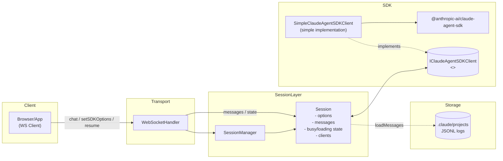
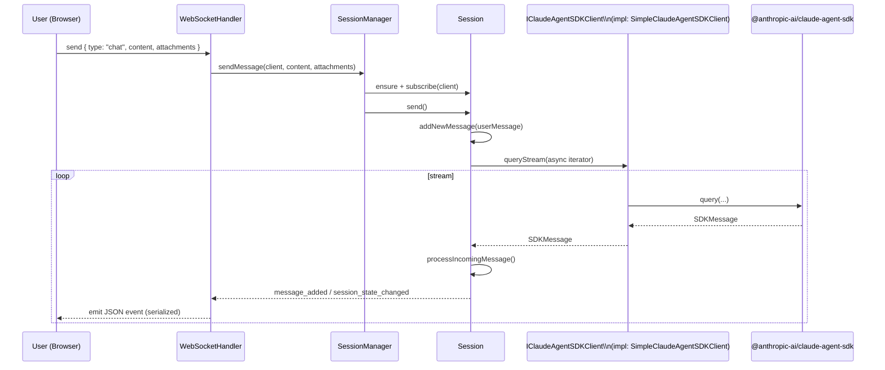
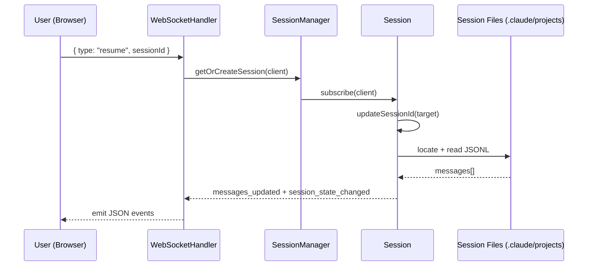

# Claude Agent Kit

Utilities, patterns, and examples built around `@anthropic-ai/claude-agent-sdk`. The toolkit streamlines session management, message parsing, and upcoming UI primitives so you can stand up Claude-powered agents quickly.

- **Session lifecycle helpers** for keeping local state in sync with Claude.
- **Message parsing utilities** that normalize Claude streaming payloads.
- **WebSocket orchestration** for multi-client real-time experiences.
- **Examples and UI groundwork** to accelerate new agent surfaces.

> ℹ️ The package currently targets `@anthropic-ai/claude-agent-sdk@^0.1.47`. Adjust the version in `package.json` to match the SDK release you are using.

## Getting Started

```bash
pnpm install
pnpm run build
```

Import the pieces you need from the scoped packages:

```ts
import { buildUserMessageContent } from "@claude-agent-kit/messages";
import { SessionManager, SimpleClaudeAgentSDKClient } from "@claude-agent-kit/server";
import { WebSocketHandler } from "@claude-agent-kit/websocket";
```

## Quick Usage Example

```ts
import { SessionManager, SimpleClaudeAgentSDKClient } from "@claude-agent-kit/server";
import type { AttachmentPayload } from "@claude-agent-kit/messages";

const sessionManager = new SessionManager();
const session = sessionManager.createSession(new SimpleClaudeAgentSDKClient());
const attachments: AttachmentPayload[] | undefined = undefined;
await session.send("List the open pull requests in this repo.", attachments);

for (const message of session.messages) {
  console.log(`[${message.type}]`, message.content.map((part) => part.content));
}

```

## Examples

This repo includes two runnable examples that demonstrate different integration styles:

- Basic chat app powered by Bun WebSocket server: `examples/basic-example`
- Web app (Express + Vite + ws) with a richer UI: `examples/claude-code-web`

### Basic Example (Bun)

Run a minimal chat experience with Bun, a simple React UI, and a WebSocket bridge.

Steps:

```bash
pnpm install
export ANTHROPIC_API_KEY=your-key-here
cd examples/basic-example
bun run dev
# open http://localhost:3000
```

Key server wiring (simplified):

```ts
// examples/basic-example/server/server.ts
import "dotenv/config";
import path from "node:path";
import { BunWebSocketHandler } from "@claude-agent-kit/bun-websocket";
import { SimpleClaudeAgentSDKClient, type SessionSDKOptions } from "@claude-agent-kit/server";

const sdkClient = new SimpleClaudeAgentSDKClient();
const defaultOptions: SessionSDKOptions = {
  cwd: path.join(process.cwd(), "agent"),
  thinkingLevel: "default_on",
};

const wsHandler = new BunWebSocketHandler(sdkClient, defaultOptions);

const server = Bun.serve({
  port: 3000,
  websocket: {
    open(ws) { wsHandler.onOpen(ws); },
    message(ws, msg) { wsHandler.onMessage(ws, msg); },
    close(ws) { wsHandler.onClose(ws); },
  },
  fetch(req, server) {
    const url = new URL(req.url);
    if (url.pathname === "/ws") {
      server.upgrade(req, { data: { sessionId: "" } });
      return;
    }
    return new Response("OK");
  },
});
```

Client sends chat messages over WS as JSON:

```ts
// minimal client shape
const ws = new WebSocket("ws://localhost:3000/ws");
ws.onopen = () => {
  ws.send(JSON.stringify({ type: "chat", content: "Hello!" }));
};
ws.onmessage = (ev) => {
  const msg = JSON.parse(ev.data);
  // { type: "message_added" | "messages_updated" | "session_state_changed", ... }
};
```

### Claude Code Web (Express + Vite)

Run a full-stack dev server that serves the client via Vite and streams messages over `ws`.

Steps:

```bash
pnpm install
export ANTHROPIC_API_KEY=your-key-here
cd examples/claude-code-web
pnpm dev
# open http://localhost:5173
```

Key server wiring (simplified):

```ts
// examples/claude-code-web/src/server/server.ts
import express from 'express'
import { createServer as createHttpServer } from 'node:http'
import { WebSocketServer } from 'ws'
import { SimpleClaudeAgentSDKClient } from '@claude-agent-kit/server'
import { WebSocketHandler } from '@claude-agent-kit/websocket'

export async function createServer() {
  const app = express()
  const httpServer = createHttpServer(app)
  const wss = new WebSocketServer({ server: httpServer })
  const sdkClient = new SimpleClaudeAgentSDKClient()
  const wsHandler = new WebSocketHandler(sdkClient, { thinkingLevel: 'default_on' })

  wss.on('connection', (ws) => {
    void wsHandler.onOpen(ws)
    ws.on('message', (data) => wsHandler.onMessage(ws, String(data)))
    ws.on('close', () => wsHandler.onClose(ws))
  })

  return { app, httpServer, wss }
}
```

Minimal client usage is identical to the Bun example; the endpoint is the WS server you configure (e.g., `ws://localhost:5173`). For a robust React hook with auto‑reconnect and session resume, see `examples/claude-code-web/src/client/hooks/use-web-socket.ts`.

## System Design

This section summarizes the architecture, data flow, and key components of the Claude Agent Kit. It mirrors the dedicated doc previously in `docs/system-design.md`.

### Overview

- Purpose: Accelerate building Claude-powered agents by packaging session/state management, message utilities, and transport glue around `@anthropic-ai/claude-agent-sdk`.
- Packages:
  - `@claude-agent-kit/messages` — Types and helpers for composing user inputs and rendering SDK messages.
  - `@claude-agent-kit/server` — Session, options, streaming, and persistence helpers that wrap the SDK.
  - `@claude-agent-kit/websocket` — Node.js WebSocket bridge for multi-client real-time chat.
  - `@claude-agent-kit/bun-websocket` — Bun WebSocket bridge for the same real-time chat flows.

### Architecture



Key responsibilities:
- Client sends chat, SDK option updates, or resume requests via WebSocket.
- Handler parses inbound messages, delegates to `SessionManager`, and re-broadcasts server events to the client.
- `SessionManager` ensures a `Session` exists per client/session id and routes calls.
- `Session` orchestrates streaming with the SDK, tracks messages and state, persists session id, and fans out updates to attached clients.
- Storage helpers read historical JSONL logs to restore transcripts by session id.

Notes:
- `SimpleClaudeAgentSDKClient` is a minimal implementation of the `IClaudeAgentSDKClient` interface. Consumers can derive or replace it with their own SDK client implementation (e.g., to add logging, retries, or custom transport).
- `WebSocketHandler` can be subclassed or swapped for alternative transports while retaining the `SessionManager`/`Session` core.

### Critical Flows

#### Chat (streaming)



Error handling:
- Invalid payloads are rejected with structured errors (e.g., `code: "empty_message"`).
- Socket send failures are caught and logged; session state continues.
- `AbortController` is used to interrupt in-flight queries per session.

#### Resume existing session



### Package Responsibilities

- `@claude-agent-kit/messages`
  - Build user composition blocks from prompt + attachments for the SDK input.
  - Normalize and coalesce SDK streaming messages into UI-friendly chat messages.
  - Notable APIs:
    - buildUserMessageContent(prompt, attachments)
    - appendRenderableMessage(messages, incoming)
    - convertSDKMessages(sdkMessages)

- `@claude-agent-kit/server`
  - `Session`: wraps SDK streaming, tracks `messages`, `isBusy`, `isLoading`, and emits client-facing events. Merges `SessionSDKOptions` with safe defaults, infers `cwd` from incoming system messages when possible, and supports `interrupt()`.
  - `SessionManager`: manages multiple sessions, subscription lifecycle, and delegates actions.
  - `SimpleClaudeAgentSDKClient`: thin adapter around `@anthropic-ai/claude-agent-sdk` `query()` and local log loading.
  - Persistence utilities: discover `.claude/projects` and parse JSONL transcripts.

- `@claude-agent-kit/websocket` and `@claude-agent-kit/bun-websocket`
  - WebSocket handlers and session client shims for Node (`ws`) and Bun (`ServerWebSocket`).
  - Input messages: `chat`, `setSDKOptions`, `resume`.
  - Output messages: `message_added`, `messages_updated`, `session_state_changed`.

### Data Model and Options

- Session state
  - `sessionId`: Claude session identifier (assigned on first stream result)
  - `messages`: array of `SDKMessage` (as received), plus UI projections in the app using `@claude-agent-kit/messages`
  - `isBusy`/`isLoading`: driven by system/result stream events
  - `summary`, `usageSummary`, `error`: derived metadata

- Session options (`SessionSDKOptions`)
  - Extends SDK `Options` with `thinkingLevel`, `cwd`, `allowedTools`, `mcpServers`, and optional `hooks`.
  - Defaults are composed and normalized; setting `cwd` to blank removes it from the effective options.

- Attachments
  - Images (base64) are inlined; plain text is decoded to `document` blocks; PDFs are preserved as base64.

### Extensibility

- Transports: Implement another `ISessionClient` and handler to plug in alternative protocols (e.g., HTTP SSE, Socket.IO).
- Persistence: Swap or augment the JSONL reader to use a database or object store; keep `Session.loadFromServer()` as the seam.
- Policy: Customize `allowedTools`, `mcpServers`, or `thinkingLevel` at connection time via `setSDKOptions`.

### Notable Implementation References

- Session lifecycle and streaming: packages/server/src/server/session.ts:1
- WebSocket bridge (Node): packages/websocket/src/websocket-handler.ts:1
- WebSocket bridge (Bun): packages/bun-websocket/src/bun-websocket-handler.ts:1
- Message shaping/coalescing: packages/messages/src/messages/messages.ts:1
- Attachments to user blocks: packages/messages/src/messages/build-user-message-content.ts:1
- Session log discovery/parsing: packages/server/src/utils/session-files.ts:1

### Example Usage

- Basic Bun server + client using the Bun WebSocket handler: examples/basic-example/server/server.ts:1
- Express + ws dev server with Vite: examples/claude-code-web/src/server/server.ts:1

---

## Testing

```bash
pnpm test
```

The Vitest configuration only scans `src/**/*.{test,spec}.{ts,tsx}` so you can colocate tests with the implementation without affecting the published build artifacts. Use `pnpm run test:watch` for an interactive loop.

## Contributing

1. Fork the repository.
2. Install dependencies with `pnpm install`.
3. Run `pnpm run build` and open a pull request with your changes.

## License

This project is licensed under the MIT License. See `LICENSE` for details.
